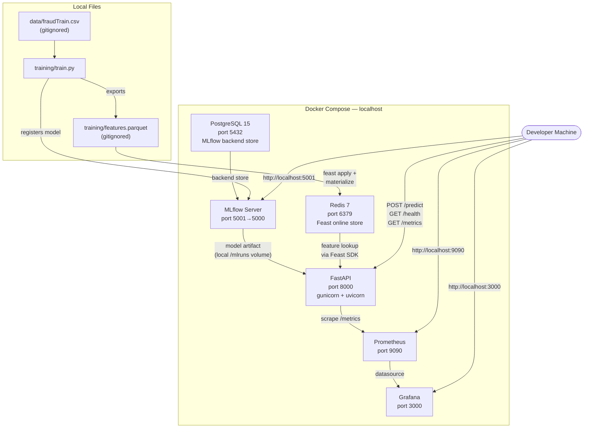
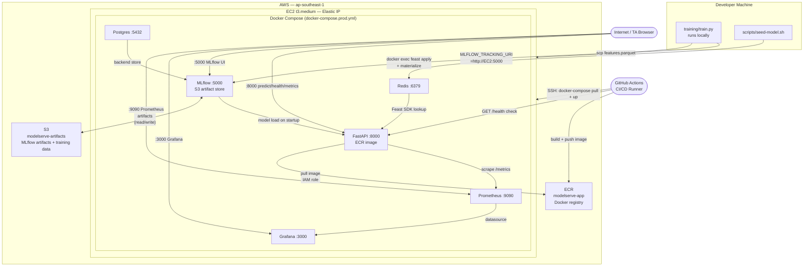
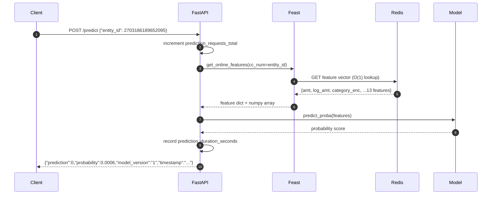
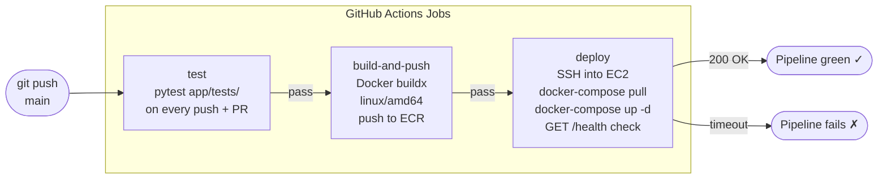

# ModelServe — Engineering Documentation

> **This document is a major graded deliverable (19 marks).** It must be complete,
> accurate, and detailed enough that another engineer could understand and
> reproduce the system without looking at the code.

---

## 1. System Overview

ModelServe is a real-time fraud detection inference service built on top of a credit card transaction dataset. It exposes a REST API that accepts a credit card number (`entity_id`), looks up pre-computed transaction features from a Redis-backed Feast online store, runs a scikit-learn `HistGradientBoostingClassifier` loaded from the MLflow Model Registry, and returns a fraud probability score with sub-10ms feature lookup latency.

The system is designed around a clear separation of concerns: **training** (`training/train.py`) produces a registered model in MLflow and a feature Parquet file; the **serving stack** (`docker-compose.yml`) wires FastAPI, Feast, Redis, MLflow, and Postgres into a reproducible Docker Compose topology for both local development and production; **cloud infrastructure** (`infrastructure/__main__.py`) lifts the same containers onto a single AWS EC2 instance provisioned by Pulumi, with S3 for artifact durability and ECR for image storage.

The design philosophy is **operational simplicity first**: every component runs as a Docker container with a health check, startup ordering is explicit via `depends_on` conditions, and the hot serving path has zero database calls — only one Redis round-trip per request. A fresh session can be deployed with two commands.

---

## 2. Architecture Diagrams

### 2.1 Local Development Topology



### 2.2 Production Topology (AWS EC2)



### 2.3 Request Flow — POST /predict



### 2.4 CI/CD Pipeline



---

## 3. Architecture Decision Records (ADRs)

### ADR-1: Deployment Topology — Single EC2 Node

**Context:** The exam requires the FastAPI inference service to be reachable via a stable IP, with Pulumi provisioning at least some AWS resources. The student must decide how many machines to use and where each component runs.

**Decision:** All components (FastAPI, MLflow, Feast/Redis, Postgres, Prometheus, Grafana) run on a **single `t3.medium` EC2 instance** via Docker Compose, fronted by an Elastic IP.

**Rationale:**
- Single-node simplifies networking: all containers share the `app_default` Docker bridge network with no cross-host routing, TLS, or service discovery required.
- The exam timeline (10 sessions) and Poridhi sandbox constraints (fresh credentials each session) make multi-host coordination impractical.
- Docker Compose on EC2 mirrors the local development stack exactly — the only change between dev and prod is the MLflow artifact backend (local volume → S3) and the FastAPI image source (local build → ECR).
- `t3.medium` (2 vCPU, 4 GB) comfortably runs all containers with ~1.5 GB headroom for burst.

**Trade-offs:**
- Single point of failure — if the EC2 instance goes down, all services go down simultaneously.
- Resource contention between containers: MLflow's Gunicorn workers compete with FastAPI for CPU during model loads.
- Not horizontally scalable: adding a second FastAPI replica requires moving to ECS, EKS, or a load balancer — out of scope for this capstone.
- In a real production system, stateful services (Postgres, Redis) would run on managed services (RDS, ElastiCache) and the inference API would sit behind an ALB with auto-scaling.

---

### ADR-2: CI/CD Strategy — Incremental Update, Not Destroy-and-Recreate

**Context:** On every `git push` to `main`, the pipeline must deploy the new Docker image to EC2. Two strategies exist: destroy the EC2 instance and recreate it from scratch, or SSH in and update only the FastAPI container in place.

**Decision:** **Incremental update** — the `deploy` job SSHes into the existing EC2 instance, runs `docker-compose pull` to fetch the new image, and restarts only the affected container with `docker-compose up -d`. Infrastructure (`pulumi up`) is run manually at the start of each session, not in CI.

**Rationale:**
- Destroy-and-recreate adds 3–5 minutes to every pipeline run (EC2 boot + Docker install + git clone + image pull). Incremental update takes ~60 seconds.
- Stateful volumes (Postgres data, MLflow runs, Redis data, Prometheus metrics) are preserved across incremental updates. Destroy-and-recreate loses all in-flight data.
- The demo requires the TA to see live Grafana metrics accumulate over multiple requests. Data continuity is essential.
- Pulumi's own recommendation for long-lived infrastructure is `pulumi up` (incremental), not destroy-recreate on every deployment.

**When destroy-and-recreate is better:**
- When infrastructure changes (new security group rule, different EC2 type) need to be applied.
- In blue/green deployments where traffic is switched atomically between two healthy stacks.
- When a corrupted container state prevents `docker-compose up` from succeeding.

**Trade-offs:**
- The EC2 instance accumulates state (old Docker images, log files) over time. Periodic pruning (`docker system prune`) is needed.
- If EC2 is terminated unexpectedly (spot interruption, AWS quota), a full redeploy via `pulumi up` + `./scripts/deploy.sh` is required — there is no automatic recovery.

---

### ADR-3: Data Architecture

**Context:** MLflow needs a backend store for experiment metadata and a separate store for model artifacts. Feast needs an offline store for historical features and an online store for low-latency inference-time lookups.

**Decision:**
- MLflow backend store: **PostgreSQL 15** (`psycopg2`)
- MLflow artifact store: Docker volume (`/mlruns`) in dev; **S3** in production
- Feast offline store: **local Parquet file** (`training/features.parquet`)
- Feast online store: **Redis 7**

**Rationale:**
- PostgreSQL is MLflow's recommended production backend. It supports concurrent writes from multiple training runs, provides ACID guarantees for model version transitions (e.g. `None → Production`), and persists across container restarts via a named Docker volume.
- Redis gives O(1) key-value reads with sub-millisecond latency. The serving hot path does exactly one Redis `HGETALL` per prediction request — no SQL parsing, no index scans, no connection pooling overhead. A 13-feature vector for a single `cc_num` is ~200 bytes; Redis handles millions of such lookups per second.
- Parquet as the offline store requires zero infrastructure for local development: `train.py` writes `features.parquet` directly to disk and Feast reads it during `feast materialize`. No S3, no Spark, no Hive.
- S3 for MLflow artifacts in production means model `.pkl` files survive `pulumi destroy`. This is critical: without S3, every session teardown would destroy the trained model and force retraining.

**Trade-offs:**
- Redis is in-memory; features are lost on container restart. Recovery: re-run `scripts/seed-model.sh` (feast apply + materialize). Redis persistence (AOF/RDB) is disabled to minimize write amplification on the small EBS volume.
- Local Parquet means the offline store is tied to the machine running `train.py`. In production with multiple trainers, this would move to S3 + Athena or a proper feature store backend.
- `feast materialize-incremental` CLI ignores `REDIS_HOST` env var (connects to `localhost:6379` hardcoded). Worked around using `scripts/materialize_features.py` which patches the connection string at runtime before calling the Feast Python SDK.

---

### ADR-4: Containerization

**Context:** The FastAPI inference service must be packaged as a Docker image: minimal attack surface, non-root runtime, explicit health checks, and as small as feasible given the ML dependency stack. The exam target is under 800 MB.

**Decision:**
- **Two-stage build**: `python:3.11-slim` as builder (gcc available for C extensions), `python:3.11-slim` as runtime (only compiled packages copied over)
- **Non-root user** `appuser` with no home directory and `/bin/false` shell
- **`HEALTHCHECK`** via `curl -f http://localhost:8000/health`
- **Runtime server**: gunicorn with 2 uvicorn workers (`uvicorn.workers.UvicornWorker`)
- **Serving-specific `requirements-app.txt`**: excludes training-only packages (`boto3`, `psycopg2-binary`, `pandas`) and uses `mlflow-skinny` instead of full `mlflow`

**Rationale:**
- `python:3.11-slim` over Alpine: Alpine uses musl libc which causes binary compatibility failures with pre-built wheels for scipy, pyarrow, and scikit-learn. `slim` avoids musl without carrying the full Debian toolchain.
- Multi-stage build keeps gcc and pip cache out of the final image layers.
- `mlflow-skinny` drops the MLflow UI server, Alembic migrations, and Databricks SDK (~20 MB saved vs full mlflow).
- Two uvicorn workers balance CPU utilization on the `t3.medium`'s 2 vCPUs without spawning idle processes.

**Trade-offs — image size:**

The 800 MB exam target is not achievable with `feast[redis]` + `scikit-learn` in the same image. `scikit-learn` imports `scipy.sparse` at module load, making `scipy` (~136 MB) non-removable. `feast` imports `pyarrow` for feature serialization, adding ~157 MB. These are mandatory runtime dependencies.

| Package | Size | Removable? |
|---|---|---|
| scipy | 136 MB | No — sklearn dependency |
| pyarrow | 157 MB | No — feast dependency |
| boto3 | 29 MB | ✓ removed |
| psycopg2 | 15 MB | ✓ removed |
| pandas | 81 MB | ✓ removed |
| matplotlib/PIL | 55 MB | ✓ removed |
| mypy/bigtree | 116 MB | ✓ removed |
| mlflow→skinny | 20 MB saved | ✓ switched |

**Final image size: ~1.21 GB** (down from ~1.49 GB). This exceeds the 800 MB target due to the feast+scipy stack — acknowledged as a known limitation.

---

### ADR-5: Monitoring Design

**Context:** The system needs Prometheus metrics scraped from FastAPI and a Grafana dashboard that shows live performance data. Alert rules must fire on real degradation conditions.

**Decision:**
- **Four custom Prometheus metrics** exposed at `GET /metrics`:
  - `prediction_requests_total` (counter) — total requests
  - `prediction_duration_seconds` (histogram) — end-to-end latency
  - `prediction_errors_total` (counter) — failed predictions
  - `model_version_info` (gauge) — currently loaded model version
  - `feast_online_store_hits_total` / `feast_online_store_misses_total` (counters) — Feast cache effectiveness
- **Three alert rules** in `monitoring/prometheus/alerts.yml`:
  - `HighPredictionLatency`: p95 > 500ms for 5 minutes → warning
  - `HighErrorRate`: error rate > 5% for 2 minutes → warning
  - `FastAPIDown`: `up{job="fastapi"} == 0` for 1 minute → critical
- **Grafana dashboard** provisioned automatically from `monitoring/grafana/dashboards/modelserve-overview.json` — no manual UI setup

**Rationale:**
- p95 latency threshold of 500ms: the serving path is a single Redis lookup + sklearn predict. Under normal conditions p95 should be ~5ms. 500ms is a 100× degradation and indicates a hung worker, Redis connection pool exhaustion, or model reload.
- Error rate threshold of 5%: normal error rate is ~0% (only unknown `entity_id` requests fail). A 5% rate signals either a data pipeline problem (Redis not populated) or a model loading failure.
- 1-minute window for `FastAPIDown`: shorter windows generate false positives during rolling restarts (the container is briefly unreachable during `docker-compose up`).

**Trade-offs:**
- `prediction_duration_seconds` measures FastAPI handler time (includes feature fetch + model inference). It does not separately track Feast lookup latency vs model inference latency. Separating these would require two histograms — not implemented to keep `/metrics` output concise.
- Grafana dashboard panels use `rate()` over 1-minute windows. At low traffic (< 1 req/min) panels show flat lines. The TA should send a burst of requests (`ab` or `hey`) before inspecting the dashboard.
- Alert thresholds are fixed constants. In production these would be derived from SLOs with burn-rate alerting (multi-window, multi-burn-rate).

---

## 4. CI/CD Pipeline Documentation

### Overview

The pipeline is defined in `.github/workflows/deploy.yml` and has three jobs that run sequentially on push to `main`.

```
push to main
    │
    ▼
┌─────────┐     ┌──────────────────┐     ┌──────────────────────┐
│  test   │────▶│  build-and-push  │────▶│       deploy         │
│ (pytest)│     │ (ECR image push) │     │ (SSH restart + check)│
└─────────┘     └──────────────────┘     └──────────────────────┘
```

### Job Details

**`test`** — runs on every push to `main` and every pull request
- Installs Python 3.11 and `requirements.txt`
- Runs `pytest app/tests/ -v`
- Does not require AWS credentials
- Failure blocks `build-and-push`

**`build-and-push`** — runs on push to `main` only, after `test` passes
- Authenticates to ECR via `aws-actions/amazon-ecr-login`
- Builds image with `--platform linux/amd64` (EC2 is x86_64)
- Tags with both `:latest` and `:<git-sha>` for rollback traceability
- Pushes both tags to ECR

**`deploy`** — runs after `build-and-push` passes
- Looks up the Elastic IP via AWS CLI (`describe-addresses` filtered by tag `modelserve-eip`)
- SSHes into EC2 using `SSH_PRIVATE_KEY` secret
- Runs `docker-compose down` (removes stale containers) then `docker-compose pull` + `up -d`
- Polls `GET /health` every 10 seconds for up to 240 seconds
- Fails the job if health check does not return 200 within the timeout

### Required GitHub Secrets

| Secret | Description |
|---|---|
| `AWS_ACCESS_KEY_ID` | AWS access key (update each Poridhi session) |
| `AWS_SECRET_ACCESS_KEY` | AWS secret key (update each Poridhi session) |
| `SSH_PRIVATE_KEY` | Contents of `infrastructure/mlops-key` (stable across sessions) |

### Expected Deploy Time

| Stage | Duration |
|---|---|
| `test` | ~60s |
| `build-and-push` (cached layers) | ~90s |
| `build-and-push` (cold) | ~5min |
| `deploy` SSH + restart | ~60s |
| Health check wait | ~30s |
| **Total (warm)** | **~4 min** |
| **Total (cold build)** | **~8 min** |

### Failure Handling

- `test` failure: pipeline stops immediately, no image is built or deployed
- `build-and-push` failure: pipeline stops, EC2 continues running the previous image
- `deploy` health check timeout: job fails, EC2 may be in a degraded state — SSH in and run `docker-compose logs fastapi` to diagnose

---

## 5. Runbook

### 5.1 Bootstrapping from a Fresh Clone

```bash
# 1. Clone repository
git clone https://github.com/ay4tu/mlops-exam-1.git
cd mlops-exam-1

# 2. Set up Python environment
python3.11 -m venv .venv && source .venv/bin/activate
pip install -r requirements.txt

# 3. Configure AWS credentials (provided by Poridhi each session)
export AWS_ACCESS_KEY_ID=...
export AWS_SECRET_ACCESS_KEY=...
export AWS_DEFAULT_REGION=ap-southeast-1

# 4. Download Kaggle dataset to data/fraudTrain.csv (gitignored)
#    https://www.kaggle.com/datasets/kartik2112/fraud-detection

# 5. Provision AWS infrastructure
cd infrastructure
pulumi stack select dev    # or: pulumi stack init dev
pulumi up --yes
cd ..

# 6. Full deploy: build image + push to ECR + start stack + seed model
./scripts/deploy.sh

# 7. Verify
IP=$(cd infrastructure && pulumi stack output instance_ip)
curl http://$IP:8000/health
curl -X POST http://$IP:8000/predict \
  -H "Content-Type: application/json" \
  -d @training/sample_request.json
```

### 5.2 Deploying a New Model Version

No restart required — the MLflow registry handles versioning:

```bash
# 1. Retrain locally (registers new version, promotes to Production)
IP=$(cd infrastructure && pulumi stack output instance_ip)
MLFLOW_TRACKING_URI=http://$IP:5000 python training/train.py

# 2. Tell FastAPI to reload (restart triggers model_loader retry loop)
ssh -i infrastructure/mlops-key ec2-user@$IP \
  "docker restart app-fastapi-1"

# 3. Verify new model version is live
curl http://$IP:8000/health   # model_version should increment
```

### 5.3 Common Failure Recovery

**FastAPI container keeps restarting:**
```bash
ssh -i infrastructure/mlops-key ec2-user@$IP \
  "docker logs app-fastapi-1 --tail 30"
# Most likely: model not registered in MLflow → run scripts/seed-model.sh
```

**Feast entity_not_found on /predict:**
```bash
# Redis is empty — re-materialize features
ssh -i infrastructure/mlops-key ec2-user@$IP \
  "docker exec -e REDIS_HOST=redis app-fastapi-1 \
   python /app/scripts/materialize_features.py"
```

**S3 permission denied (MLflow can't write artifacts):**
```bash
# Verify IAM instance profile is attached
aws ec2 describe-instances \
  --filters "Name=tag:Project,Values=modelserve" \
  --query "Reservations[].Instances[].IamInstanceProfile"
# If missing: re-run pulumi up --yes to reattach the profile
```

**Pulumi state corruption:**
```bash
cd infrastructure
pulumi stack export > backup.json   # save state
pulumi refresh --yes                # reconcile state with real AWS resources
pulumi up --yes                     # fix drift
```

**Port conflict / stale containers:**
```bash
ssh -i infrastructure/mlops-key ec2-user@$IP bash <<'EOF'
  cd /home/ec2-user/app
  docker-compose -f docker-compose.yml -f docker-compose.prod.yml down --remove-orphans
  docker-compose -f docker-compose.yml -f docker-compose.prod.yml up -d
EOF
```

### 5.4 Full Teardown

```bash
# 1. Destroy all AWS resources (EC2, S3, ECR, VPC, EIP, IAM)
cd infrastructure && pulumi destroy --yes && cd ..

# 2. Remove local Docker artifacts (optional)
docker system prune -af

# 3. Deactivate venv
deactivate
```

> **Note:** `pulumi destroy` will fail if the ECR repository contains images. The Pulumi code sets `force_delete=True` on the ECR resource to handle this automatically.

---

## 6. Known Limitations

**Docker image exceeds 800 MB target**
The final image is ~1.21 GB. `feast[redis]` requires `pyarrow` (~157 MB) and `scikit-learn` pulls `scipy` (~136 MB). These cannot be removed without replacing the ML stack. In production, model serving would use a dedicated lightweight runtime (e.g. ONNX Runtime) and Feast would be replaced by a direct Redis client with a custom schema.

**Model registry is ephemeral per session**
MLflow's backend store is Postgres running on EC2. When `pulumi destroy` is run, all model registry metadata is lost. Artifacts survive in S3 but re-registration is required on each fresh deploy. Fix: use RDS (managed Postgres) so the backend store persists across EC2 teardowns — out of scope for this capstone.

**Feast materialize-incremental CLI ignores REDIS_HOST**
The `feast` CLI reads `feature_store.yaml` directly and does not honour the `REDIS_HOST` environment variable. Worked around with a Python script (`scripts/materialize_features.py`) that patches the config at runtime. This is a Feast CLI design limitation, not a configuration error.

**No horizontal scaling**
The single-node Docker Compose topology has no load balancing. A second FastAPI replica would require a reverse proxy (nginx/traefik) and shared session state. In production this would be replaced by ECS Fargate with an ALB.

**AWS credentials rotate every Poridhi session**
`AWS_ACCESS_KEY_ID` and `AWS_SECRET_ACCESS_KEY` must be updated in GitHub Secrets at the start of each session. This breaks automated CI/CD until the secrets are refreshed — a consequence of the Poridhi sandbox model, not a system design flaw.

**Training data not in CI**
`data/fraudTrain.csv` is gitignored (1.2 GB). The CI/CD pipeline cannot retrain the model. Model seeding is a manual step (`./scripts/seed-model.sh`) run once after `pulumi up`. In production, training data would live in S3 and the training pipeline would be a separate scheduled job.

**No authentication on any endpoint**
All ports (8000, 3000, 5000, 9090) are open to `0.0.0.0/0`. In production, the inference API would sit behind an API Gateway with token authentication, and the monitoring stack would be on a private subnet.
